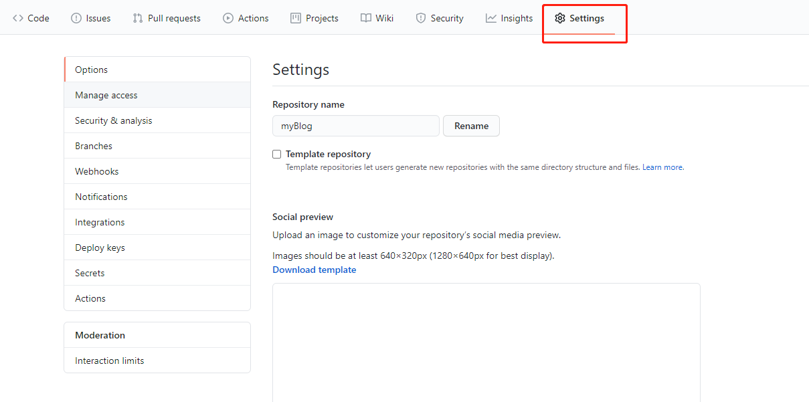
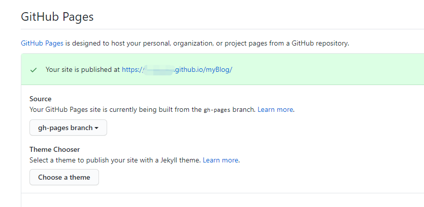

## 搭建与部署

### 什么是vue-press？

VuePress 由两部分组成：第一部分是一个[极简静态网站生成器](https://github.com/vuejs/vuepress/tree/master/packages/%40vuepress/core)，它包含由 Vue 驱动的[主题系统](https://www.vuepress.cn/theme/)和[插件 API](https://www.vuepress.cn/plugin/)，另一个部分是为书写技术文档而优化的[默认主题](https://www.vuepress.cn/theme/default-theme-config.html)，它的诞生初衷是为了支持 Vue 及其子项目的文档需求。

[官方介绍](https://www.vuepress.cn/guide/)

### 快速搭建

```
npm create vuepress
```

然后根据命令行的提示，输入相应信息即可。

### 目录结构

.vuepress/config.js：vue-press的配置文件的文件入口

* 在.vuepress/config.js中设置正确的base（两种情况）：

1. 发布到 https://<USERNAME>.github.io/，则可以省略这一步，因为 base默认即是 "/"。
2. 发布到 https://<USERNAME>.github.io/<REPO>，则将 base设置为 "/<REPO>/"。

### 部署

部署的流程主要是：把程序打包后，docs/.vuepress/dist的文件提交到github

```
#!/usr/bin/env sh

# 确保脚本抛出遇到的错误
set -e

# 生成静态文件
# 对应package.json文件中的编译打包命令
npm run build

# 进入生成的文件夹
cd docs/.vuepress/dist

# 如果是发布到自定义域名
# echo 'www.example.com' > CNAME

git init
git add -A
git commit -m 'deploy'

# 如果发布到 https://<USERNAME>.github.io
# git push -f git@github.com:<USERNAME>/<USERNAME>.github.io.git master

# 如果发布到 https://<USERNAME>.github.io/<REPO>
# 新建gh-pages分支
git push -f https://github.com/<USERNAME>/<REPO>.git master:gh-pages

cd -

```

### 在GitHub上配置

1. 在你的GitHub远程仓库里找到setting



2. 一直往下找，找到GitHub Pages选项，在source中选择刚刚提交dist文件的分支 gh-pages，出现提示信息Your site is published at https://<username>.github.io/myBlog/

   

3. 点击打开链接https://<username>.github.io/<repo>，能成功访问首页则代表部署、配置都成功了。
